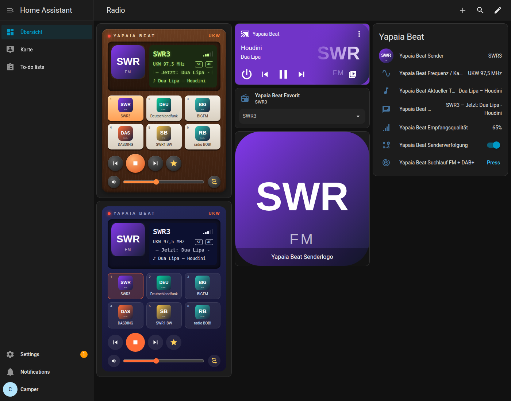
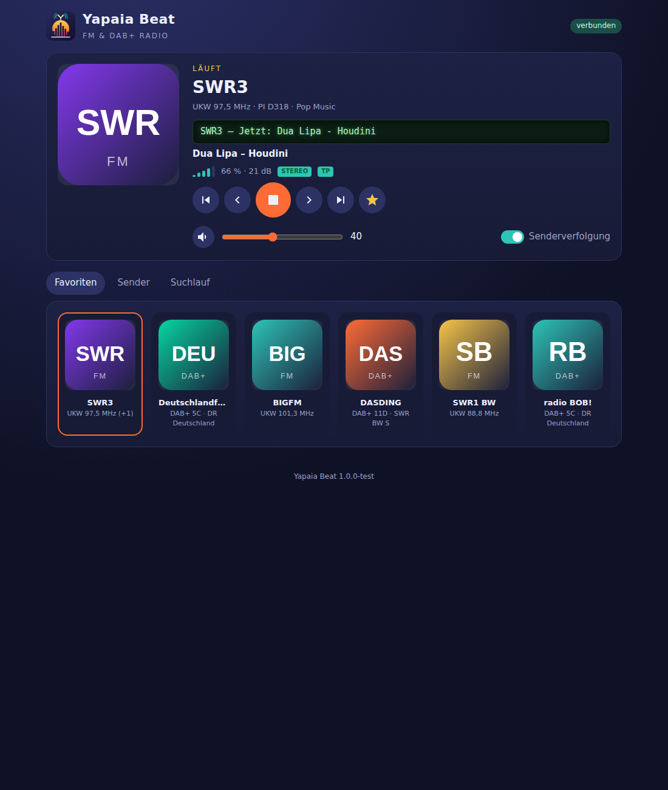
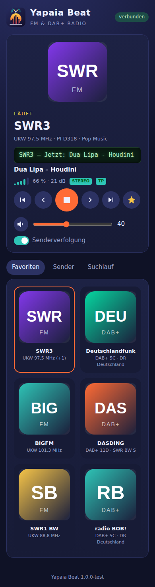

<p align="center"></p>

# Yapaia Beat – FM & DAB+ Radio für Home Assistant

Ein Home-Assistant-Add-on, das mit einem **RTL-SDR USB-Stick** UKW- und
DAB+-Radio empfängt – autark, ohne Internet, ideal für den **Camper**.

- 📻 **UKW mit RDS** (Sendername, Radiotext, RadioText+, PTY, AF, TP) und **DAB+ mit DLS & Slideshow**
- 🔎 **Automatischer Suchlauf**, **Favoriten**, Suche nach **Name oder Frequenz**
- 🖼️ **Senderlogos** (radio-browser.info mit lokalem Cache, eigene Uploads, generierte Logos)
- 🚐 **Automatische Senderverfolgung**: RDS-AF/PI-Code, andere DAB-Kanäle, Wechsel UKW ↔ DAB+
- 🔊 Wiedergabe über die **Audioausgabe von Home Assistant** und als **MP3-Stream**
- 🏠 **Integration mit Entitäten für Standard-Karten** + eigene **Radio-Karte** (Retro & Modern)

<p align="center"></p>

<p align="center">
  
  
</p>

<sub>Screenshots aus dem Simulationstest (simulierte Sender, automatisch generierte Logos).</sub>

## Installation

### Variante A – über den Add-on-Store (empfohlen, mit automatischen Updates)

[](https://my.home-assistant.io/redirect/supervisor_add_addon_repository/?repository_url=https%3A%2F%2Fgithub.com%2Fapfelsafft%2Fradio)

1. Auf den Button klicken oder in Home Assistant *Einstellungen → Add-ons →
   Add-on-Store → ⋮ → Repositories* öffnen und
   `https://github.com/apfelsafft/radio` hinzufügen.
2. **Yapaia Beat** installieren und starten.
3. Home Assistant **einmal neu starten** (das Add-on installiert dabei die
   Integration samt Radio-Karte).
4. *Einstellungen → Geräte & Dienste* → „Yapaia Beat" wurde entdeckt →
   **Konfigurieren**.
5. Seitenleiste → **Yapaia Beat** → **Suchlauf**.

Updates erscheinen danach ganz normal unter *Einstellungen → Add-ons*.

### Variante B – mit dem Installationsskript

Im Add-on **„Terminal & SSH"** bzw. **„Advanced SSH & Web Terminal"**:

```bash
# installieren (trägt das Repository ein und installiert das Add-on)
curl -fsSL https://raw.githubusercontent.com/apfelsafft/radio/main/install.sh | bash

# installieren und Home Assistant danach direkt neu starten
curl -fsSL https://raw.githubusercontent.com/apfelsafft/radio/main/install.sh | bash -s -- --restart-core

# aktualisieren
curl -fsSL https://raw.githubusercontent.com/apfelsafft/radio/main/install.sh | bash -s -- --update

# als lokales Add-on (ohne Repository im Store) installieren / aktualisieren
curl -fsSL https://raw.githubusercontent.com/apfelsafft/radio/main/install.sh | bash -s -- --local

# deinstallieren
curl -fsSL https://raw.githubusercontent.com/apfelsafft/radio/main/install.sh | bash -s -- --uninstall
```

Weitere Optionen: `--branch NAME`, `--repo URL`, `--keep-data`.

> Das Add-on-Image wird auf dem Home-Assistant-System gebaut (welle.io und
> redsea werden kompiliert). Auf einem Raspberry Pi dauert die erste
> Installation 15–30 Minuten.

## Dokumentation

Die ausführliche Anleitung (Dashboards, Entitäten, Aktionen, Optionen,
Fehlersuche) steht in [`yapaia_beat/DOCS.md`](yapaia_beat/DOCS.md) und im
Add-on unter dem Reiter **Dokumentation**.

Schnellstart für ein Dashboard:

```yaml
type: custom:yapaia-beat-card
entity: media_player.yapaia_beat
style: retro
```

## Aufbau

```
repository.yaml                 Add-on-Repository für Home Assistant
install.sh                      Installations-/Update-Skript
yapaia_beat/                    das Add-on
  config.yaml, build.yaml       Add-on-Konfiguration
  Dockerfile                    baut welle-cli (DAB+) und redsea (RDS)
  rootfs/opt/yapaia/yapaia/     Radio-Dienst (Python, aiohttp)
    dsp.py                        FM-Stereo-Decoder (MPX → Audio, Signalqualität)
    fm.py / dab.py                Empfang & Suchlauf (rtl_fm/redsea/rtl_power, welle-cli)
    radio.py                      Steuerung, Favoriten, Senderverfolgung
    logos.py                      Senderlogos
    web.py                        REST-API, WebSocket, MP3-Stream
  rootfs/opt/yapaia/www/        Web-Oberfläche (Ingress)
  rootfs/opt/yapaia/integration/yapaia_beat/
                                Home-Assistant-Integration + Lovelace-Karte
tests/                          Unit-Tests (pytest)
art/                            Logo (SVG/PNG)
```

## Lizenz

MIT. Verwendete Programme: [welle.io](https://github.com/AlbrechtL/welle.io)
(GPL-2.0), [redsea](https://github.com/windytan/redsea) (MIT),
[rtl-sdr](https://osmocom.org/projects/rtl-sdr) (GPL-2.0), LAME, mpg123.
